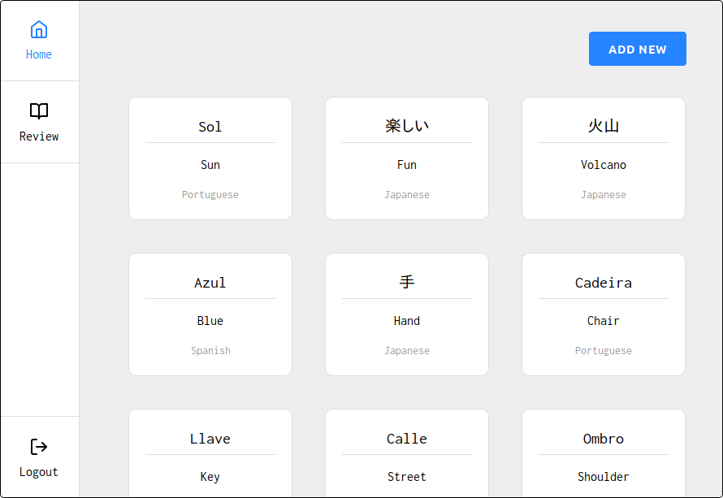

<h1 align="center">
  LangJournal
</h1>

<p align="center">
  
</p>

<p align="center">
  <b>
    :closed_book: A personal language learning journal.
  </b>
</p>

<p align="center">
  
</p>

## Sections

- [Demo](#demo)
- [Changelog](#changelog)
- [Development](#development)
- [Acknowledgements](#acknowledgements)
- [License](#license)

## Demo

During this initial development phase, LangJournal is being hosted on [Heroku](https://www.heroku.com/) and running on a free dyno, which sleeps whenever it receives no web traffic in a 30-minute period. Therefore, if the dyno is sleeping, **the page may take up to 1 minute to load**.

Link: https://langjournal.herokuapp.com/.

## Changelog

All releases are documented in the project's [changelog](/CHANGELOG.md).

## Development

### Setup

#### Installing packages

```
npm install
```

#### Creating environment variables

The server uses [cookie-session](https://github.com/expressjs/cookie-session), [Google Sign-In](https://developers.google.com/identity/sign-in/web), and [mLab](https://mlab.com/), all of which require one or more environment variables; they must be set in a non-versioned .env file, following the template below.

```
COOKIE_SESSION_SECRET=...

GOOGLE_OAUTH_CLIENT_ID=...

GOOGLE_OAUTH_CLIENT_SECRET=...

MONGO_DB_DATABASE_NAME=...

MONGO_DB_URI=...
```

### Building and running

#### Development mode

```
npm run dev
```

#### Production mode

```
npm run prod
```

### Format checking

```
npm run checkFormatting
```

### Linting

```
npm run lint
```

### Releasing (and publishing)

#### Patches

```
npm run release
```

#### Minors

```
npm run release minor
```

#### Majors

```
npm run release major
```

### Type checking

```
npm run checkTyping
```

## Acknowledgements

- [Fernando Coelho](https://github.com/omninando), [Natália Medina](https://github.com/ntmedina), [Rafael Bezerra](https://github.com/rnbez): opinions, advice, and support.

- [Eric A. Meyer](https://meyerweb.com/eric/): Reset CSS.

  - File [here](src/server/assets/reset.css).
  - Original link: https://meyerweb.com/eric/tools/css/reset/index.html.

- John Sorrentino ([Favicon.io](https://favicon.io/)): favicon.

  - File [here](src/server/assets/favicon.ico).
  - Terms of use: https://favicon.io/terms-of-use/.

- [Mozilla](https://github.com/mozilla): language list.

  - Used [here](src/consts/language.ts).
  - Original repository (with license): https://github.com/mozilla/language-mapping-list.

- [Raph Levien](https://levien.com/): Inconsolata font.

  - Loaded [here](src/server/assets/global.css), and also used in the [favicon](src/server/assets/favicon.ico).
  - Google Fonts page (with license): https://fonts.google.com/specimen/Inconsolata.

- Steve Schoger ([Hero Patterns](https://www.heropatterns.com/)): repeatable SVG background.

  - Used [here](src/client/components/LoginPage/styles.css).
  - License: https://creativecommons.org/licenses/by/4.0/legalcode.

- [Tobias Ahlin](http://tobiasahlin.com): `box-shadow` animation.

  - Used [here](src/client/components/EntryPreviewList/EntryPreview/Preview/styles.css).
  - Original link: http://tobiasahlin.com/blog/how-to-animate-box-shadow/.

  I'm also thankful to the maintainers and contributors of all open-source libraries used in this project; the direct dependencies are listed in the [package.json file](package.json), and their corresponding dependencies and licenses are available at [npm](https://www.npmjs.com/).

## License

[MPL 2.0](/LICENSE)
